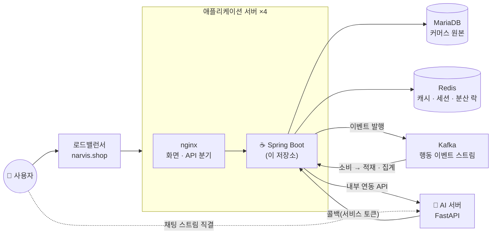

# ☕ JARVIS — 에이전틱 커머스 백엔드

> 대화로 상품을 찾고 담고 사는 **에이전틱 커머스(Agentic Commerce)** 플랫폼의 API 서버.
> 회원·상품·주문 등 커머스 트랜잭션을 소유하고, AI 에이전트가 사용자를 대신해 수행하는
> 모든 행위를 검증·기록하는 단일 관문이다.

<p>
  
  
  
  
  
  
</p>

---

## 📌 프로젝트 개요

서비스는 세 저장소로 나뉘며, 이 저장소는 **커머스 도메인의 원본 데이터를 소유하는 백엔드**를 담당한다.

| 역할 | 담당 |
|---|---|
| **백엔드 (이 저장소)** | 인증·권한, 상품·장바구니·주문·클레임·후기, 행동 이벤트 수집, AI 연동 관문 |
| 프론트엔드 | 사용자·판매자 화면, 채팅 UI, 실시간 스트림 소비 |
| AI 서버 | 대화형 추천·장바구니 에이전트, 판매자 분석 챗봇, 개인화 프로필 |

**설계의 중심은 "AI가 편해져도 데이터의 주인은 서버 하나"** 다. AI가 실행하는 쓰기(담기·상품
수정·발송 처리)는 전부 내부 연동 API를 지나고, 그 안에서 권한·재고·상태 전이가 사용자
요청과 **똑같이** 검증된다. AI 서버에는 커머스 DB 접근 권한을 주지 않는다.

### 핵심 기능

- 🔐 **인증·권한** — 액세스/리프레시 토큰을 HttpOnly 쿠키로, 로그아웃 즉시 기존 토큰 무효화, 게스트 활동의 회원 승계
- 🛒 **커머스 트랜잭션** — 주문 시점 스냅샷, 옵션 단위 재고 차감, 상태 전이 검증, 취소·반품 자동 승인
- 🤖 **AI 연동 관문** — 내부 연동 API 36종, 서비스 토큰 인증 + 입력 전건 재검증
- 📈 **판매자 분석** — 매출·퍼널·이탈 코호트·실시간 방문자 집계
- ⚡ **이벤트 파이프라인** — 행동 이벤트를 Kafka로 흘리고, 전송 실패 시 DB 직접 저장으로 자동 전환

---

## 🏗️ 시스템 구성



- 애플리케이션은 상태를 갖지 않아 4대가 동일하게 동작한다. 로그인 상태는 토큰과 Redis에 있다.
- **채팅 스트리밍만 예외적으로** 프론트엔드가 AI 서버에 직접 연결한다. 백엔드는 단명 티켓을 발급하고, AI 서버는 공개키로 검증만 한다.

---

## 🧰 기술 스택 & 선택 이유

| 영역 | 기술 | 선택 이유 |
|---|---|---|
| 언어/런타임 | **Java 21** | 가상 스레드·레코드·패턴 매칭 등 최신 문법 활용, LTS |
| 프레임워크 | **Spring Boot 3.5** | 보안 필터 체인·트랜잭션·스케줄링을 표준 방식으로 확보 |
| 데이터 접근 | **Spring Data JPA** + 네이티브 쿼리 | 도메인 CRUD는 JPA로 간결하게, 판매자 분석처럼 무거운 집계만 네이티브 SQL로 내려 성능 통제 |
| 데이터베이스 | **MariaDB 11.4** | 생성 컬럼 + UNIQUE로 "기본 배송지 1개" 같은 제약을 앱이 아닌 DB가 강제 |
| 캐시·공유 상태 | **Redis** | 서버 4대가 공유해야 하는 것만 담는다 — 캐시·채팅 세션·분산 락·요청 횟수 제한 |
| 이벤트 스트림 | **Kafka (KRaft)** | 행동 이벤트 적재를 요청 처리에서 떼어내 응답 지연을 없애고, 같은 스트림을 실시간 집계가 함께 구독 |
| 인증 | **JWT + HttpOnly 쿠키** | 스크립트가 토큰을 읽을 수 없어 유출 경로가 막히고, 서버 렌더링 첫 진입에서도 로그인 상태가 유지된다 |
| AI 연동 인증 | **RS256 단명 티켓 + 공개키 배포** | AI 서버가 신원을 만들지 않고 백엔드가 서명한 티켓을 검증만 하게 해, 신원의 출처를 하나로 고정 |
| 분산 락 | **ShedLock** | 스케줄러가 4대에서 동시에 돌아 같은 주문을 여러 번 처리하는 것을 방지 |
| 테스트 | **JUnit 5 · Testcontainers · EmbeddedKafka** | 브로커 장애 시 폴백처럼 "죽여봐야 아는 동작"을 자동 테스트로 고정 |

---

## 💡 주요 기술적 도전 & 설계 결정

1. **재고가 사는 곳은 한 군데** — 재고를 상품 컬럼이 아니라 옵션 단위 테이블로 분리하고, 차감은 결제 트랜잭션 안의 조건부 갱신으로만 한다. 담기 시점 검증은 사용자 편의를 위한 사전 안내일 뿐이고 최종 방어선은 결제 시점 하나다.
2. **주문은 스냅샷** — 상품명·가격·배송지를 주문 시점 값으로 복사해 저장한다. 이후 상품 가격이 바뀌거나 배송지가 지워져도 주문 내역이 변하지 않는다.
3. **로그는 고쳐 쓰지 않는다** — 게스트가 회원이 될 때 과거 행동 로그의 주인을 바꾸는 방식을 구현했다가 폐기했다. 공용 PC에서 남의 활동이 귀속될 수 있고 원본 이력이 왜곡되기 때문이다. 지금은 게스트 행에 전환 기록만 남기고 읽는 쪽이 매핑으로 잇는다.
4. **AI는 죽어도 되는 유일한 계층** — AI 서버 장애 시 추천은 인기 상품으로 대체되고 쇼핑 본체는 정상 동작한다. 모든 외부 호출에 타임아웃을 걸고 실패 경로를 미리 정했다.
5. **측정하고 고치고 다시 측정한다** — 부하 테스트에서 병목이 애플리케이션 CPU → 데이터베이스 CPU → 커넥션 수로 두 번 이동했다. 캐시 적용으로 처리량 31% 증가·95% 응답시간 26% 감소를 실측했다.

---

## 📂 프로젝트 구조

도메인 우선(package-by-feature) 구조다. 기능 하나를 고칠 때 폴더 하나만 보면 되도록 묶었고, 여러 도메인이 함께 쓰는 것만 `global`에 둔다.

```
src/main/java/com/jarvis/
├── member/ address/          # 회원 · 배송지
├── product/ category/ brand/ # 카탈로그
├── cart/ order/              # 장바구니 · 주문 · 클레임
├── review/ wishlist/         # 후기 · 찜
├── chat/ recommendation/     # 채팅 세션·티켓 · 추천 목록
├── profile/                  # AI 취향 프로필 (AI 서버 프록시)
├── seller/                   # 판매자 대시보드 · 분석
├── internal/                 # AI 서버 전용 연동 API
└── global/
    ├── auth/                 # JWT · 스트림 티켓 · 토큰 무효화
    ├── cache/                # Redis 캐시 공통
    ├── event/                # 행동 이벤트 수집 · Kafka 발행/소비
    ├── ratelimit/            # 요청 횟수 제한
    ├── response/             # 공통 응답 구조 · 에러 코드 · 전역 예외 처리
    └── config/               # 보안 · 스케줄러 · 외부 연동 설정

docs/backend/                 # 설계 명세 (상태 머신 · 데이터 모델 · 아키텍처 · 연동 계약)
scripts/                      # 로컬 셋업 · 시드 · 증분 마이그레이션
```

---

## 🚀 시작하기

**사전 준비** — JDK 21, Docker (MariaDB·Redis·Kafka 컨테이너용)

```bash
# 1. 로컬 환경 셋업 — .env·설정 파일 생성 + DB·Redis·Kafka 컨테이너 기동 + 스키마·시드 적용
bash scripts/setup-local.sh

# 2. 서버 실행 (JDK가 PATH에 없으면 JAVA_HOME 명시)
JAVA_HOME="/c/Program Files/Microsoft/jdk-21.0.11.10-hotspot" ./gradlew bootRun

# 3. 확인
curl http://localhost:8080/actuator/health     # {"status":"UP"}

# 4. 테스트 · 빌드
./gradlew test          # 단위 · 통합 551건
./gradlew bootJar       # build/libs/jarvis-backend-*.jar
```

PowerShell에서는:

```powershell
$env:JAVA_HOME = "C:\Program Files\Microsoft\jdk-21.0.11.10-hotspot"; .\gradlew.bat bootRun
```

**평가용 계정** — 배포 서버(https://narvis.shop)에서 바로 확인할 수 있다.
일반 사용자 `autumn@narvis.shop` / 판매자 `spring@narvis.shop` (비밀번호는 제출 문서 참조).

### 로컬 데이터 준비 (셋업 스크립트가 자동 수행)

| 순서 | 스크립트 | 내용 |
|---|---|---|
| 1 | `docs/backend/schema.sql` | 전체 스키마 (최초 1회) |
| 2 | `scripts/seed-accounts.sql` | 데모 계정 (판매자·구매자) |
| 3 | `scripts/seed-catalog.sql` | 상품·브랜드·카테고리 |
| 4 | `scripts/seed-commerce-demo.sql` | 주문·후기 데모 데이터 |
| 5 | `scripts/seed-analytics-demo.sql` | 판매자 분석용 이벤트 |

이미 운영 중인 DB에 스키마 변경을 반영할 때는 `scripts/migrate-*.sql`을 날짜 순으로 적용한다
(전부 재실행해도 무해). 적용 시점(앱 배포 전/후)이 스크립트마다 다르므로 [DEPLOY.md](DEPLOY.md)의 표를 확인한다.

### API 요약

| 그룹 | 대표 경로 | 설명 |
|---|---|---|
| auth | `POST /api/auth/signup` · `login` · `refresh` | 가입·로그인·토큰 재발급 (쿠키 기반) |
| products | `GET /api/products/{id}` · `popular` · `recommended` | 상품 상세·인기·개인화 추천 |
| cart | `GET/POST/PATCH/DELETE /api/cart/items` | 장바구니 (비로그인 허용) |
| orders | `POST /api/orders` · `GET /api/orders/{id}` | 주문 생성·모의 결제·조회 |
| chat | `POST /api/chat/sessions` · `tickets` | 채팅 세션·스트림 티켓 발급 |
| seller | `GET /api/seller/summary` · `orders` · `products` | 판매자 대시보드 |
| internal | `/internal/**` | AI 서버 전용 (서비스 토큰 필수) |
| 운영 | `GET /actuator/health` | 헬스 체크 |

전체 명세(요청/응답 스키마·에러 코드)는 [docs/backend/04-api-spec.md](docs/backend/04-api-spec.md).

### 환경변수

전체 목록은 [.env.example](.env.example). **값이 없으면 기동에 실패하는 항목**과 선택 항목이 나뉜다.

| 변수 | 로컬 | 운영 | 설명 |
|---|---|---|---|
| `DB_URL` · `DB_USERNAME` · `DB_PASSWORD` | 셋업 스크립트가 생성 | **필수** | MariaDB 접속 정보 |
| `REDIS_HOST` · `REDIS_PORT` | 기본 `localhost:6379` | **필수** | 캐시·세션·분산 락 |
| `KAFKA_BOOTSTRAP_SERVERS` | 기본 `localhost:9092` | **필수** | 행동 이벤트 스트림 |
| `APP_KAFKA_PREFIX` | `dev-` | 환경별 구분 | 토픽·컨슈머 그룹 접두어 (개발·운영 격리) |
| `JWT_SECRET` | 셋업 스크립트가 생성 | **필수** | 액세스/리프레시 토큰 서명. 교체하면 전원 재로그인 |
| `STREAM_TICKET_PRIVATE_KEY` · `STREAM_TICKET_KID` | 셋업 스크립트가 생성 | **필수** | 채팅 스트림 티켓 서명키(RS256). 공개키는 백엔드가 배포 |
| `INTERNAL_API_TOKEN` | 셋업 스크립트가 생성 | **필수** | AI 서버와 공유하는 서비스 토큰. **양쪽 값이 같아야 연동된다** |
| `LLM_BASE_URL` · `LLM_SSE_URL` | 선택 | AI 연동 시 필요 | AI 서버 주소. 비우면 채팅이 축소 동작하고 기동에는 지장 없음 |
| `APP_COOKIE_SECURE` | 기본 `true` | `true` | `localhost`가 아닌 주소로 http 테스트할 때만 `false` |

시크릿은 저장소에 **실제 값을 두지 않는다.** 배포용은 새로 생성해 시크릿 저장소로 주입한다(생성 명령은 [DEPLOY.md](DEPLOY.md) 참조).

---

## 🔀 Git 워크플로 & 규칙

**3단 브랜치** — `기능 브랜치 → dev → main`. 기능 브랜치는 변경 자체의 타당성을, `dev`는 다른
사람의 변경과 합쳤을 때의 통합 여부를, `main`은 운영 배포 가능 여부를 판단하는 지점이다.
`main` push가 곧 운영 배포라 통합 버퍼로 `dev`를 둔다.

| 브랜치 | 병합 시 동작 |
|---|---|
| `feat/*` `fix/*` `docs/*` | Pull Request에서 테스트 실행 (이미지 빌드는 생략해 피드백 단축) |
| `dev` | 개발 서버 1대에 자동 배포 |
| `main` | 운영 서버 4대에 무중단 순차 배포, 실패 시 자동 되돌리기 |

- 기능 브랜치 → `dev`는 squash로 이력을 압축하고, `dev` → `main`은 머지 커밋을 남긴다.
  여기까지 squash하면 두 브랜치의 이력이 갈라져 릴리스마다 가짜 충돌이 쌓인다.
- 커밋 메시지는 [Conventional Commits](https://www.conventionalcommits.org) (`feat:` `fix:` `docs:` `refactor:` `test:` `chore:`).
- Pull Request는 자동 코드 리뷰를 거치며, 마지막 성공 리뷰 이후의 변경만 분석한다. 최종 승인은 팀원이 한다.
- `.env`·`application-local.yml`은 커밋하지 않는다(gitignore 확인).

---

## 📎 문서

| 문서 | 내용 |
|---|---|
| [DEPLOY.md](DEPLOY.md) | 배포 절차 — 이미지 빌드·환경변수·DB 반영·헬스체크 |
| [docs/backend/](docs/backend/README.md) | 설계 명세 01~08 (상태 머신 · 데이터 모델 · 아키텍처 · API · AI 연동 계약 · Redis · Kafka) |
| [docs/backend/schema.sql](docs/backend/schema.sql) | 전체 스키마 (23개 테이블) |
| [scripts/README.md](scripts/README.md) | 셋업·시드·마이그레이션 스크립트 안내 |
