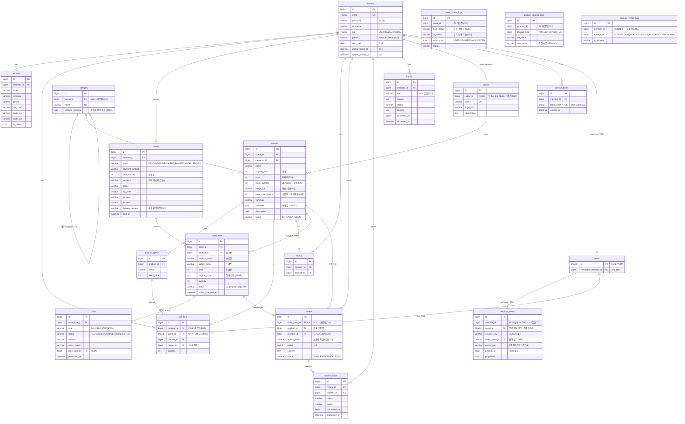

# 02. 데이터 모델(ERD) 명세

> 기준: 「기능 정의 - 이소희」 + [01 주문 상태 머신](01-order-state-machine.md)
> DB: MariaDB 11.x (AWS RDS for MariaDB), utf8mb4 · InnoDB. JPA 엔티티는 이 문서의 테이블 정의를 그대로 따른다.
> 공유용 DDL 스냅샷: [schema.sql](schema.sql) — 이 문서(§3)가 원본이며, §3 변경 시 함께 갱신할 것.
> 2026-07-09: 노션 「상품 참고」「로그 참고」(7/9 공유) 대조 설계 세션 — D8~D13 추가, `spec` 컬럼을 `attributes`로 개칭(D11).
> 2026-07-17: 이벤트 수집 명세 합의(로그/분석 팀 + 백엔드, 구두 확정) — user_event→behavior_events 교체(D31), BE 직접 로그 3종 신설(D32), 재고 도입(D33 — D8 폐기), 교환 제거(D34). D31~D37 추가(D37: 주문 아이템 정가 스냅샷 — FE 반영).

## 1. 결정 로그

### D1. 주문 데이터는 스냅샷으로 저장한다 (파생값 금지 원칙의 예외가 아님)

- **문제**: order_item에 상품명/가격을 복사할지, product를 참조만 할지.
- **선택지**: (A) product FK 참조만 (B) 주문 시점 값 복사(스냅샷) + FK는 링크용으로만
- **기준**: 주문은 "그 시점에 일어난 사실의 기록". 상품 가격이 바뀌거나 상품이 내려가도 주문 내역·환불 금액은 변하면 안 된다.
- **선택**: (B). `order_item`에 `product_name`, `price`(주문 시점 판매가), `option_name`을 복사. product_id는 상세 이동 링크용으로만 유지.
- **트레이드오프**: 저장 공간 중복 — 무시 가능. "파생값 저장 금지"와 충돌하지 않음: 스냅샷은 현재 값에서 계산할 수 있는 파생값이 아니라 과거 사실이다.

### D2. 상품 옵션은 단일 옵션 그룹으로 단순화한다

- **문제**: 기능 정의에 "옵션·수량 선택"이 있다. 옵션을 어느 수준까지 모델링할지.
- **선택지**: (A) 다축 옵션(색상×사이즈 조합, SKU 매트릭스) (B) 단일 옵션 리스트(상품당 옵션 0~N개, 하나만 선택) (C) 옵션 없음
- **기준**: 기능 정의 요구("옵션 선택")를 만족하는 최소 모델 + 자연어 담기("파란색으로 담아줘")가 다뤄야 하는 복잡도.
- **선택**: (B). `product_option(id, product_id, name, extra_price)` — "블랙", "화이트 (+2,000원)" 식. 옵션 없는 상품은 옵션 행 0개, 장바구니/주문의 option_id는 nullable.
- **트레이드오프**: "색상+사이즈" 조합 표현 불가 → 시드 데이터에서 조합이 필요한 상품은 "블랙/M", "블랙/L"처럼 조합을 한 옵션 이름으로 풀어서 등록(운영 데이터로 우회, 스키마 확장 없이).

### D3. 최근 본 상품은 테이블을 만들지 않고 user_event를 재활용한다

- **문제**: 최근 본 상품 전용 테이블 vs 이벤트 로그 조회.
- **기준**: 같은 데이터를 두 곳에 쓰지 않는다. `PRODUCT_VIEW` 이벤트는 판매자 지표 때문에 어차피 적재한다.
- **선택**: `user_event`에서 `event_type=PRODUCT_VIEW` 최신순 + product 조인, 중복 상품 제거(최신 1건), 최대 20개.
- **트레이드오프**: 조회 쿼리가 전용 테이블보다 무겁다 → `(member_id, event_type, created_at)` 인덱스로 커버, 데모 규모에서 문제 없음.
- **2026-07-17 갱신(D31)**: user_event가 behavior_events로 교체 — 소스는 `event_type='product_view'`로 대체. "전용 테이블 없이 이벤트 재활용" 원칙 자체는 유지.

### D4. 후기는 order_item과 1:1, 신고 처리는 상태 변경(soft)으로

- 후기 자격(배송완료·아이템당 1개)의 검증 앵커가 필요 → `review.order_item_id UNIQUE`. product_id/member_id는 조회용 중복 보관(조인 절약).
- 신고된 후기의 "숨김/삭제"(관리자)는 물리 삭제가 아니라 `review.status = VISIBLE/HIDDEN/DELETED`. 이유: 신고 처리 내역 화면이 처리된 후기를 계속 보여줘야 함.

### D5. 게스트는 UUID 쿠키 + guest 테이블로 추적한다 (횟수 제한 없음)

- **게스트 채팅 횟수 제한은 두지 않는다** (2026-07-07 팀 회의: "이 정도 loss는 감수" — 가입 전 이탈 방지 우선). 게스트는 무제한 채팅 가능하되 개인화만 미적용.
- guest 테이블은 카운트용이 아니라 **행동 이력(behavior_events — D31로 교체, 패턴 동일)의 주체 식별 + 가입 시 승계**를 위해 유지: `guest(id UUID, converted_member_id)`.
- 가입/로그인 시 프론트가 guestId를 전달하면 `converted_member_id` 기록 + 해당 guest의 behavior_events member_id 백필(UPDATE) + **장바구니 병합**(D30 — 같은 트랜잭션).

### D6. Refresh Token은 Redis가 아니라 DB 테이블에 저장한다

- **문제**: RT 저장소. Redis는 채팅 세션 TTL용으로 어차피 도입하는데 RT도 거기 둘지.
- **기준**: RT는 유일한 "잃어버리면 안 되는" 인증 상태(재로그인 강제됨). Redis는 데모 환경에서 재시작이 잦고 휘발돼도 되는 데이터(채팅 세션)만 두는 걸로 역할을 나눈다.
- **선택**: `refresh_token` 테이블. 로그아웃/재발급 시 row 삭제·교체.
- **트레이드오프**: 토큰 검증마다 DB 조회 — AT 검증은 서명만으로 하고 RT는 재발급 때만 조회하므로 부하 아님.

### D7. 상품 스펙은 JSON 컬럼 + 2단 검색 (EAV 대비 확정 — 2026-07-07)

- **문제**: 전 카테고리 상품의 스펙 축(소재/연결방식/피부타입…)이 제각각이다. 이걸 어떻게 저장하고, "린넨 소재만" 같은 자연어 조건 필터를 어디서 수행할지.
- **선택지**:
  - (A) `product.attributes JSON` + 2단 검색 — 서버는 문자열 LIKE로 후보만 좁히고, LLM이 attributes을 읽고 최종 선별
  - (B) EAV — `category_metadata_fields`(카테고리별 필드 "틀") + `product_metadata_values`(상품별 값 행). 서버가 `WHERE field='소재' AND value='린넨'`으로 정밀 필터
- **기준**: ① 스펙의 실소비자가 누구인가 — LLM(통째로 읽음)과 상세페이지 스펙 표(통째로 렌더)뿐, 필드 단위 SQL 소비자(필터 UI·등록 폼) 없음 ② 데이터 소스가 크롤링 — 소스마다 키·값이 자유 텍스트
- **선택**: (A). 근거 두 가지 —
  - **비용**: B는 크롤링 필드→field_id 매핑 ETL과 상품당 N행 조인이 즉시 발생
  - **이득 미실현**: B의 핵심 이득(서버 정밀 필터)은 값이 정규화돼야 성립하는데, 크롤링 값은 "린넨 100%"/"면 50% 린넨 50%" 같은 자유 텍스트라 결국 `value LIKE`로 후퇴 → JSON LIKE와 정확도가 같아짐
- **동작 방식 (구현 기준)**:
  - 검색 파라미터(I-1)는 **컬럼 축만**: keyword/category/가격/브랜드. 스펙 메타데이터는 파라미터(입력)가 아니라 **응답(출력)**으로 나간다 — LLM이 세밀 조건을 파라미터로 보내는 게 아니라, 후보의 attributes을 받아 읽고 거른다
  - 1차(DB): `name/summary LIKE + CAST(attributes AS CHAR) LIKE` — "글자가 있는 상품"을 놓치지 않고 수집(재현율). 인덱스 없는 풀스캔이지만 상품 수백 개 규모에서 무시 가능. **⚠ 전제 변경(2026-07-13)**: 크롤링 실데이터가 1만 개 이상으로 확인 — 수백 개 전제가 깨짐. 시드 적재 후 이 쿼리와 인기 상품 집계를 실측(EXPLAIN)하고, 느리면 아래 전환 경로의 FULLTEXT(ngram) 단계를 당길지 결정 — **고민 필요, 미결**
  - 2차(LLM): 후보(≤30)의 attributes을 읽고 "의미가 맞는 상품"만 선별(정밀도)
- **전환 경로 (EAV로 가는 조건)**: ① 필드 단위 필터 UI 또는 카테고리 기반 상품 등록 폼이 로드맵에 오르고 ② 값 정규화(사전 구축)가 가능해지는 시점. 그때 B 구조(위 스키마)로 마이그레이션 — attributes JSON의 키를 순회해 행으로 옮기는 기계적 작업이라 전환 비용 낮음. 검색 성능이 먼저 병목이 되면(수만 상품) FULLTEXT 인덱스 → 검색엔진 순으로 중간 단계도 있음.

### D8. ~~재고는 모델링하지 않는다~~ (2026-07-09 → 2026-07-17 이벤트 수집 명세로 폐기 → D33)

- **문제**: 「상품 참고」(7/9)에 `stock/availability`가 있고 03 §7의 담기 흐름도 "재고 검증"을 언급하는데, product 테이블에는 재고 컬럼이 없다 — 문서 간 모순. 재고를 모델링할지, 어느 수준까지 할지.
- **선택지**: (A) 재고 미모델링 — 전 상품 항상 구매 가능 (B) `product.stock` 표시용 컬럼(차감 없음) (C) 차감까지 — 주문 시 감소, 클레임 승인 시 복원, 동시성 제어
- **기준**: ① 기능 정의(MVP 기준 문서)에 재고/품절 요구가 있는가 — 없음. 상품 상세 요구는 이미지/가격/옵션·수량/스펙/리뷰/연관추천/브랜드뿐 ② 데모 가치 vs 리스크 — 추천받은 상품이 품절이면 핵심 플로우(추천→담기→구매)가 그 자리에서 막힘. 품절은 데모에서 가치가 아니라 리스크 ③ 소비처 — 판매자 MVP 지표(매출/조회수/담김수)에도 재고 없음.
- **선택**: (A). 판매 중지 표현이 필요하면 이미 있는 `product.status=HIDDEN`으로 커버(노출 자체를 끔). (B)는 아무도 안 읽는 컬럼(member OAuth와 같은 YAGNI 논리), (C)는 모의 결제에 실재고 정합이라는 비용 불일치.
- **트레이드오프**: 품절·재고 기반 시나리오 불가 — MVP 시나리오에 없음을 확인하고 감수. 고도화 시 `stock` 컬럼 추가 + 조건부 UPDATE(`SET stock=stock-n WHERE stock>=n`) 차감으로 확장 — 01 §6과 같은 패턴이라 분산 3대에서도 안전. 03 §7의 "재고" 문구는 이 결정에 맞춰 정정함.
- **2026-07-17 폐기(→ D33)**: 전제("재고의 소비처 없음")가 깨짐 — 판매자 에이전트의 재고 조정(internal I-11)과 재고 변경 로그(D32 STOCK)가 재고 실체를 요구. 위 트레이드오프의 확장 패턴 그대로 도입.

### D9. 평점 평균·리뷰 수는 반정규화하지 않는다 (「상품 참고」와 의도적 상이 — 2026-07-09)

- **문제**: 「상품 참고」는 `rating_avg`/`review_count`/`total_review_count`를 product 고정 컬럼(자주 필터/정렬)으로 제안. 현행 원칙은 파생값 저장 금지(조회 시 집계).
- **선택지**: (A) 조회 시 review 집계(현행) (B) product에 반정규화 컬럼 + 리뷰 쓰기 시 갱신
- **기준**: ① 규모 — 상품 300+·리뷰 수천(시드) 수준에서 페이지당 20개 서브쿼리 집계는 ms 단위 ② 정합 비용 — (B)는 리뷰 등록/숨김(HIDDEN)/삭제(DELETED) 3개 경로 전부에 갱신 로직이 필요, 하나라도 새면 조용히 drift(JPA 벌크 연산·동시 쓰기에서 특히) ③ 정렬 소비처 실재 — 인기 신호(브랜드 홈 인기순, 인기 상품 P-4)는 평점이 아니라 판매·조회(order_item, behavior_events — 2026-07-17 D31로 교체) 집계로 이미 정의됨. 평점은 카드·상세 **표시용**뿐, 평점 정렬/필터 UI 없음.
- **선택**: (A) 유지. 「상품 참고」의 전제(수만 상품 + 필드 단위 필터·정렬 UI)가 우리 MVP에 없음 — 참고 문서와 다르게 가는 근거를 남긴다.
- **트레이드오프**: 상품 목록 조회마다 집계 조인 비용 → 페이지네이션(≤30)으로 상수 규모 유지. 병목이 실측되면 그때 컬럼 추가 + backfill 1쿼리로 전환(전환 비용 낮음).

### D10. ~~카테고리는 flat 1단을 유지한다~~ (2026-07-09 피그마 검토로 폐기 → D20)

- **문제**: 「상품 참고」의 `category_no`는 "중분류/소분류"를 가리킴(계층 전제). 현행 category는 name만 있는 flat.
- **선택지**: (A) flat 유지 (B) `parent_id` 자기참조 계층
- **기준**: 소비처 — 메인 카테고리 목록(클릭→채팅 검색), 브랜드 홈 카테고리 필터, LLM 검색 파라미터(I-1 `categoryName`). 전부 "카테고리 1개 지정"으로 충분하고 계층 브라우징 UI가 없음. 시드 규모도 8~12개 — 계층으로 나눌 폭이 아님.
- **선택**: (A). 크롤링 소스가 중/소분류 구조로 오면 **소분류를 우리 카테고리로 평탄화**해 매핑(시드 단계에서 처리, 스키마 무관).
- **트레이드오프**: "패션 > 남성 > 셔츠" 식 트리 탐색 불가 — 해당 화면이 MVP에 없음. 필요 시 `parent_id` 컬럼 1개 추가로 확장(기존 행은 그대로 루트가 됨).

### D11. 카테고리가 속성 축을 정의한다 — `category.attribute_schema` + `spec`→`attributes` 개칭 (2026-07-09)

- **문제**: 「상품 참고」의 attributes는 "그 카테고리 상품이라면 공통으로 갖는 속성 축"(의류=소재/색상/사이즈/기장…)이다. D7은 값의 **저장 방식**(JSON vs EAV)만 확정했고, "축의 정의는 카테고리 소관"이라는 도메인 사실이 스키마 어디에도 없다. 축의 정의를 어디에 둘지 + 컬럼 네이밍.
- **선택지**:
  - (A) 현행 — `product.attributes` 자유 스키마, 축은 암묵(시드 문서로만 존재)
  - (B) `category.attribute_schema JSON` — 카테고리 행에 축(키 목록) 저장, 서버 검증은 안 함(soft schema)
  - (C) `category_attribute` 별도 테이블 — EAV의 절반(D7에서 기각한 방향으로의 후퇴)
- **기준**: ① 축 정의의 소비자가 실재하는가 — (i) **시드 생성**: 카테고리당 수십 상품을 LLM팀과 만들 때 축 계약이 없으면 같은 카테고리 안에서 키가 제각각 → 2단 검색(D7)의 LLM 선별 품질에 직결 (ii) **LLM 조건 추출**: "린넨 소재 이불" → 그 카테고리의 축을 알면 조건 추출·선별 프롬프트가 정확해짐 (iii) **판매자 상품 수정(S-3)**: 축이 있어야 수정 폼을 그릴 수 있음(자유 JSON 편집은 UX가 아님) ② D7 정신(값은 자유 텍스트, 서버 정밀 필터 없음)과 충돌하지 않는가 — 축은 "키 목록" 수준이므로 충돌 없음 ③ 비용 — JSON 컬럼 1개.
- **선택**: (B). 형식은 단순 키 배열 `["소재","색상","사이즈"]`로 시작(예시값이 필요해지면 객체로 확장). 서버는 저장 시 검증하지 않는다 — 크롤링 값의 자유 텍스트를 그대로 수용(D7 유지). **네이밍은 `spec` → `attributes`로 개칭**: 팀 공용 참고 문서(「상품 참고」)와 어휘를 통일해 LLM팀과의 시드·계약 논의가 한 단어로 진행되게 함. 구현 전이라 rename 비용 0 (03/04/05의 spec 표기도 함께 정정).
- **트레이드오프**: `attribute_schema`와 `product.attributes` 간 drift 가능(서버 미검증) → 감수 방법: 시드 파이프라인이 schema를 읽어 상품을 생성(생성 시점 정합 보장), 판매자 수정 폼도 schema 기반 렌더. drift가 나도 최종 소비자(LLM)는 자유 텍스트를 읽으므로 기능이 죽지 않고 품질만 하락 — 저위험.

### D12. ~~로그는 user_event 단일 테이블을 유지한다~~ (「로그 참고」 대조 — 2026-07-09 → 2026-07-17 대부분 번복 → D31·D32)

- **문제**: 「로그 참고」(7/9)는 로그 4종(`user_event_log`/`session_log`/`admin_event_log`/`login_history`)과 범용 스키마(`target_type`/`target_id`/`event_result`/`duration_ms`)를 제안. 현행은 `user_event` 1개(5개 타입, product_id 특화). 어디까지 수용할지.
- **기준**: ① MVP 소비처 — 판매자 페이지는 MVP에서 "지표 조회 수준"(기획서), AI 분석 4종(매출 이상/전환율/행동/이탈)은 고도화(7/31) 구간 ② 대화·세션 미저장 정책(03)과의 충돌 여부 ③ append-only 테이블은 나중에 타입·meta 확장이 무마이그레이션이라, "미리 넓게"의 이득이 작음.
- **테이블별 판단**:
  - `session_log` — **미도입**. 채팅 세션은 Redis TTL 휘발(D6·03 확정), 대화 미저장 정책과 정면 충돌. 고도화의 이탈 분석이 세션 경계를 요구하면 CHAT_QUERY meta의 sessionId로 재구성하거나 그때 도입.
  - `admin_event_log` — **미도입**. 관리자 페이지 자체가 MVP 제외. 고도화의 "관리자 질문형 에이전트"가 필요로 하는 시점에 참고 문서 스키마(before/after JSON) 그대로 추가 가능.
  - `login_history` — **미도입**. 이상 로그인 탐지는 MVP 기능이 아님. 필요 시 user_event에 LOGIN 타입 추가로도 흡수 가능.
  - `user_event` 범용화(target_type/target_id/event_result/duration_ms 컬럼) — **미수용**. 판매자 MVP 지표의 축은 전부 상품이므로 `product_id` 특화 컬럼+인덱스가 직접적. 체류시간·결과 같은 부가정보는 `meta JSON`이 스키마 변경 없이 흡수.
- **선택**: 현행 user_event 유지. 「로그 참고」는 고도화 확장의 **로드맵**으로 취급.
- **트레이드오프**: 고도화 AI 분석이 요구하는 데이터 밀도(체류시간, 세션 퍼널)가 MVP 기간에 실데이터로 쌓이지 않음 → 감수 방법: 어차피 데모 데이터는 시드 — 고도화 시작 시 확장 타입의 과거분 이벤트를 시드로 함께 생성. 타입 추가는 append-only라 과거 데이터 소급이 필요 없음.
- **2026-07-17 번복(→ D31·D32)**: 이 결정이 미룬 "AI 분석의 데이터 밀도"가 이벤트 수집 명세로 현행 요구가 됨 — user_event 자체가 behavior_events(세션·페이지뷰 포함)로 교체(D31), login_history에 해당하는 account_event_logs 등 BE 로그 3종 신설(D32). 존속하는 부분: admin_event_log 미도입, 채팅 대화 미저장 정책(03).

### D13. 개인화 프로필 테이블은 BE ERD에 없다 (05 원칙 재확인 — 2026-07-09)

- 기능 정의의 "대화 기반 프로필 갱신 → 홈 개인화 추천"은 **데이터 소유가 LLM 팀**(05 계약 원칙: "개인화 프로필은 LLM 팀 소유"). BE는 P-5에서 FastAPI 추천 API를 호출하는 소비자일 뿐, 프로필 스키마를 갖지 않는다 — ERD에 프로필 테이블이 없는 것은 누락이 아니라 결정.
- 저장 시점·형식은 05 §4 OPEN. 합의가 "BE DB 저장"으로 뒤집히면 `member_profile(member_id UNIQUE, preferences JSON)` 1테이블 추가로 수용(확장 경로 확보).

### D14. 상품 이미지는 단일로 확정한다 (기능 정의 4번과 의도적 상이 — 2026-07-09 ERD 리뷰)

- **문제**: 기능 정의 4번은 "상품 이미지(복수)"인데, 시드·크롤링 부담 대비 복수 이미지의 데모 가치를 재평가.
- **기준**: ① 소비처 — 카드·목록·상세 전부 대표 이미지 1장으로 성립하고, 복수의 유일 소비처는 상세 이미지 슬라이더 UI뿐 ② 비용 — 상품 300+개 × 복수 이미지 수집·검수는 시드 작업의 최대 비용 축 ③ 되돌림 비용이 낮은가.
- **선택**: 단일. `product.image_url` 컬럼으로 흡수, product_image 테이블 삭제(테이블 17개).
- **트레이드오프**: 상세 슬라이더 불가 — 감수. 복수가 다시 필요해지면 product_image(1:N) 재도입 + image_url을 0번 행으로 옮기는 기계적 마이그레이션. ⚠️ **기능 정의 원본(노션)과 어긋남 — 팀 공유·반영 필요 안건.**

### D15. 가격 컬럼은 `price`(판매가) + `original_price`(정가) (2026-07-09 ERD 리뷰)

- `sale_price` → `price` 개칭. 「상품 참고」의 `price`+`list_price`와 같은 계열로 팀 어휘 통일 — "실판매가가 곧 price, 정가는 original_price" 규약 고정. 05 응답 필드도 `salePrice` → `price` 동기. 할인율은 여전히 파생 계산(저장 금지).

### D16. member: 약관 동의 시각 제거, 성별·출생일 추가 (2026-07-09 개정)

- 약관 동의는 MVP 범위에서 제외(팀 결정) — `agreed_terms_at` 삭제, A-1의 agreeTerms 필드·검증도 제거. 재도입 시 컬럼 복원 + 가입 폼 체크박스만 되살리면 됨.
- `gender`(MALE/FEMALE/OTHER), `birth_date` 추가 — 가입 폼 필수 수집(팀 결정). 당장의 소비처는 시드·데모 페르소나와 판매자 고객 분석 축이고, 고도화에서 인구통계 하이브리드 추천 후보.

### D17. refresh_token은 원문이 아니라 해시로 저장한다 (MVP부터)

- 원문 저장은 DB 유출 = 전 활성 세션 탈취와 동치라 MVP여도 하지 않는다(팀 결정). `token` → `token_hash` = SHA-256 hex, CHAR(64) UNIQUE.
- 흐름: 발급 시 원문은 클라이언트 응답으로만 나가고 서버는 해시만 INSERT → 재발급/로그아웃 시 제출된 토큰을 해시해 조회. 비용은 요청당 해시 1회 — 무시 가능. (D6의 "저장 위치=DB" 결정은 유지, 저장 형태만 강화)

### D18. 크롤링 베이스라인 수치는 스냅샷 컬럼으로 저장한다 (2026-07-09)

- **문제**: 초기 데이터를 11번가 크롤링으로 적재한다(팀 확정). 누적 판매량처럼 **우리 DB에 원본 거래가 존재하지 않는 수치**가 생김. "파생값 저장 금지" 원칙은 원본에서 재계산 가능함이 전제인데, 크롤링 누적치는 재계산이 불가능한 외부 사실.
- **선택**: `product.base_sales_count`(크롤링 시점 누적 판매량, 시드 이후 불변). **표시·정렬용 판매량 = base_sales_count + 자체 판매분(order_item 집계, 조회 시 합산)**. D1 스냅샷과 같은 논리(과거 사실의 기록)라 파생값 금지와 충돌하지 않음.
- 자체 발생분까지 컬럼에 누적하지 않는 이유는 D9와 동일(갱신 경로 drift). 인기 정렬은 누적(base+자체), P-4 "인기 상품"은 최근 7일 트렌드(자체분만) — 용도가 다름.
- 재고는 이 대상이 아님 — D8 유지("다 팔린다" 가정). *(2026-07-17: D8은 D33으로 폐기되어 재고 컬럼이 생겼고, 시드 초기 재고는 전 상품 일괄 100으로 확정 — D33.)*

### D19. 크롤링 리뷰는 review 행으로 적재한다 (2026-07-09)

- **문제**: D18과 같은 뿌리 — 크롤링 리뷰(별점·내용)는 우리 주문이 없는데, 현행 review는 `order_item_id UNIQUE NOT NULL`이라 적재 불가. 리뷰 0개로 오픈하면 상세페이지·평점이 데모에서 죽는다.
- **선택지**: (A) review 행으로 적재 — order_item_id/member_id NULL 허용 + author_name 추가 (B) product에 base_rating_avg/base_review_count 컬럼 (C) 크롤링 리뷰 미사용, 시드에서 가짜 회원·주문·리뷰 생성
- **기준**: ① 상세페이지가 요구하는 건 통계 숫자만이 아니라 **리뷰 목록 원문** — (B)는 통계와 목록 숫자가 안 맞는 화면이 됨 ② 작업량 — (C)는 상품 300+개에 가짜 주문 체인까지 생성 ③ 평점 통계의 단일 소스 — (A)면 크롤링분+자체분이 한 테이블에서 자연 집계(D9 원칙 그대로).
- **선택**: (A). `member_id IS NULL` = 크롤링 리뷰. 후기 자격 검증(D4: 배송완료·아이템당 1개)은 **우리 회원의 작성 경로에만 적용** — 크롤링 리뷰는 시드 적재 전용이고 API로는 생성 불가.
- **트레이드오프**: NOT NULL 제약 완화로 "리뷰=검증된 구매" 불변식이 약해짐 → 감수 방법: 작성 API는 여전히 order_item 앵커 필수(서비스 검증), NULL 조합 정합(`member_id NULL ↔ author_name NOT NULL`)도 서비스 검증. UNIQUE(order_item_id)는 NULL 다중 허용이라 그대로 동작.

### D20. 카테고리는 2단 계층으로 개정한다 (D10 폐기 — 피그마 검토 2026-07-09)

- **문제**: 브랜드홈 시안의 필터가 소분류(원피스/스커트/니트/재킷…)를 요구하고, 메인 해시태그는 대분류(#패션/#디지털…) 8개다. flat 1단(D10)으로는 두 입도를 동시에 만족할 수 없다.
- **선택지**: (A) 소분류만 category로 두고 대분류는 `group VARCHAR` 라벨 (B) `parent_id` 자기참조 2단 고정 (C) attributes의 "품목" 키로 브랜드홈 필터
- **기준**: ① 대분류가 독립 엔티티인가 — 메인 해시태그로서 아이콘·노출 순서를 가짐 → 행이어야 자연스러움 ② 쿼리 비용 — 2단 고정이면 조인 1번, 재귀 없음 ③ attribute_schema의 주인은 소분류(원피스와 팬츠의 축이 다름) ④ (C)는 서버 미검증 JSON이라 필터 신뢰도 부족.
- **선택**: (B). 규약: **product.category_id는 소분류(leaf)만 참조**, attribute_schema도 소분류에만. 메인 해시태그 = `parent_id IS NULL` 조회. 크롤링 소스(11번가)의 중/소분류 구조를 그대로 매핑(D10의 "평탄화" 폐기).
- **트레이드오프**: 시드 규모 증가 — 대분류 8 + 소분류 40~80 (§5 갱신).
- **확장 노트 (2026-07-10 정정)**: "3단 이상은 재설계"는 부정확 — parent_id 자기참조(인접 리스트)는 깊이 무관이라 **스키마는 이미 N단을 수용**한다. "대분류/소분류"는 라벨일 뿐이고 시스템의 앵커는 트리 **위치** 둘뿐: **뿌리**(`parent_id IS NULL`) = 메인 해시태그, **잎** = 상품 연결 + attribute_schema 소유. 따라서 중간 단(중분류) 삽입은 스키마·앵커 변경 없이 가능. 단이 늘 때 실제로 바뀌는 건 두 가지 — ① I-1의 "하위 전체 포함" 검색이 조인 1번에서 재귀(recursive CTE)로 ② 브랜드홈 필터를 어느 단에 걸지(UI 결정). MVP는 화면이 2단만 소비하므로 2단 규약 유지.

### D21. 약관 동의 2건 복원 — D16 부분 개정 (피그마 검토 2026-07-09)

- 회원가입 시안의 **[필수] 이용약관 + [필수] 개인정보처리방침** 2건이 팀 확정 — D16의 "약관 제거"를 되돌린다. 증빙은 건별 저장: `agreed_terms_at`, `agreed_privacy_at` (둘 다 NOT NULL). A-1 body·검증 복원.
- `gender`는 시안대로 `MALE`/`FEMALE` 2값 확정(OTHER 제거).

### D22. 배송 요청사항은 주문 스냅샷에 저장한다 (피그마 검토 2026-07-09)

- 결제 화면의 배송 요청사항(문 앞에/경비실/부재 시 연락/직접 입력)은 배송지의 속성이 아니라 **그 주문 1회성 지시** → address가 아니라 `orders.delivery_request VARCHAR(200) NULL`. O-1 body에 `deliveryRequest?` 추가.

### D23. inquiry에 title 추가 — 제목·내용은 LLM이 생성 (피그마 검토 2026-07-09)

- 문의 내역 목록이 제목을 표시한다. 접수 채널이 문의 챗봇 단일(I-5)이므로 **제목은 LLM이 문의 내용을 요약해 생성**해서 content와 함께 전달. `inquiry.title VARCHAR(200) NOT NULL`, I-5 body에 title 추가(05 동기). 상태 흐름(PENDING/IN_PROGRESS/DONE)은 그대로.

### D24. 표시용 주문번호는 저장하지 않고 파생한다 — `ORD-{yyyyMMdd}-{id}` (2026-07-09)

- **문제**: 시안의 `ORD-20250601` 형식은 날짜만으로는 유일하지 않다(같은 날 다건·사용자 간 중복). 별도 채번(무작위) 컬럼 vs 파생.
- **기준**: ① 유일성 ② 주문 조회 API가 전부 인증 기반이라 주문번호로 리소스에 접근하지 않음 → 추측 곤란성 요구 낮음 ③ 컬럼·채번기 없이 가능한가.
- **선택**: 파생 — 응답에서 `orderNo = "ORD-" + created_at(yyyyMMdd) + "-" + id`. 유일성은 id가 보장, 날짜는 가독용. 같은 날 여러 주문도 id가 달라 충돌 없음.
- **트레이드오프**: id 노출로 누적 주문량 추정 가능(데모에서 무의미). 실서비스화 시 무작위 채번 UNIQUE 컬럼으로 교체 — orderNo는 표시 계약이라 FE 무변경.

### D25. brand.seller_id는 NULL을 허용한다 (ERD 정합 검토 — 2026-07-10)

- **문제**: 시드 계획(§5)은 브랜드 15~30개에 판매자 계정 2~3개만 연결하는데 `seller_id NOT NULL` — 크롤링 브랜드 전부에 회원이 있어야 INSERT 가능(시드 블로커).
- **선택지**: (A) 브랜드마다 더미 SELLER 회원 생성 (B) NULL 허용
- **기준**: (A)는 member의 NOT NULL 컬럼(약관 동의 시각·성별·출생일)을 가입한 적 없는 가짜 인물로 채워 회원 데이터의 의미를 오염시킨다. (B)는 "아직 입점 판매자가 연결되지 않은 브랜드"라는 도메인 사실 그대로.
- **선택**: (B). MariaDB UNIQUE는 NULL 다중 허용이라 "판매자 1명 = 브랜드 1개" 제약은 유지. 판매자 플로우는 member→brand 방향 유도(03 §7)라 영향 없음 — 주인 없는 브랜드는 대시보드 주인이 없는 게 맞다.

### D26. FK가 못 막는 교차 정합 4건은 서비스 검증으로 강제한다 (ERD 정합 검토 — 2026-07-10)

FK는 "참조 행이 존재하는가"만 보장하고 "**올바른** 행을 참조하는가"는 못 본다. 아래 4건은 서비스 레이어가 유일한 방어선 — 구현 필수(§6 체크리스트 반영):

1. **옵션↔상품 소속**: cart 담기·주문 스냅샷 생성 시 `option.product_id == productId` 검증 — 위반 400 `CART_OPTION_INVALID`. 안 하면 남의 상품 옵션 이름·추가금이 주문에 박힌다.
2. **leaf 카테고리(D20)**: 상품 등록·수정·시드 적재 시 category가 `parent_id IS NOT NULL`(소분류)인지 검증.
3. **review 중복 컬럼 유도(D4)**: `product_id`/`member_id`는 body로 받지 않고 서버가 order_item(→orders)에서 유도해 채운다 — 클라이언트 주장 금지.
4. **주문 합계 불변식**: `orders.total_amount == Σ(order_item.price × quantity)` — 서버 계산으로만 기록. total_amount는 엄밀히는 재계산 가능한 값이지만 결제 금액의 권위 컬럼으로 유지(파생값 금지 원칙의 기록된 예외).

### D27. category.name 전역 UNIQUE는 유지한다 — 동명 소분류는 시드 명명으로 회피 (2026-07-10)

- **문제**: 2단 계층(D20)에서 전역 UNIQUE면 대분류가 달라도 동명 소분류("패션>니트" vs "남성>니트")가 불가. `UNIQUE(parent_id, name)`으로 바꾸면 해소되지만, I-1 `categoryName`(이름만으로 카테고리를 해석하는 LLM 계약)이 모호해진다.
- **선택**: 전역 UNIQUE 유지. 크롤링 매핑에서 이름 충돌 시 시드 단계에서 대분류를 접두해 개칭("남성 니트"). LLM 계약의 해석 단순함 > 분류 체계 표현력(소분류 40~80개 규모에서 충분).

### D28. 판매가는 정가를 넘을 수 없다 — S-3에 original_price 편집 추가 (2026-07-10)

- **문제**: S-3가 price만 수정 가능해 가격 인상 시 `price > original_price`가 강제됨 — 할인율 파생이 음수, 취소선 정가 표기가 붕괴.
- **선택**: `price ≤ original_price` 서비스 검증(같으면 FE는 할인 미표기) + S-3 편집 필드에 original_price 포함 — 가격 인상은 정가와 함께 올린다. 표시 계약(할인율·취소선)의 전제가 항상 성립.

### D29. 삭제 정책 전수 확정 (ERD 정합 검토 — 2026-07-10)

- **MVP의 DELETE는 4경로뿐** — cart_item(본인·결제 차감)/wishlist/address/refresh_token. 전부 인바운드 FK 없는 잎 테이블이라 ON DELETE RESTRICT 전면과 충돌 없음. 나머지는 소프트 삭제(review.status, product.HIDDEN)거나 삭제 개념 없음.
- **본인 후기는 등록만**(팀 결정): 수정·삭제 API 없음, 자기 후기 신고 차단(400 `REVIEW_SELF_REPORT`). 소프트 삭제 구조상 "삭제 후 재작성"은 어차피 UNIQUE(order_item_id) 점유로 불가.
- **기본 배송지 삭제**: 다른 배송지가 있을 때만 허용 — 삭제 시 **등록순 가장 오래된 주소를 자동 기본 승격**(같은 트랜잭션). 유일한 배송지는 삭제 불가(400).
- **의도적 제외(고도화 후보)**: 클레임 철회(claim.status 값 추가로 수용), 회원 탈퇴(soft delete 경로), 최근 본 상품 개별 삭제(**기능 없음 확인 — 2026-07-10**). 마지막 건은 행동 이벤트(behavior_events — D31) append-only 원칙과 충돌하는 유일한 잠재 삭제 기능이었으나 부재 확인으로 종결 — 고도화에서 도입하려면 append-only 재설계가 선행 조건.
- 상품 등록 API는 MVP 제외지만 **스키마는 등록을 전제로 완결** — brand_id는 계정 유도, category는 leaf 선택, attributes 폼은 attribute_schema(D11) 기반. 등록 도입 시 스키마 변경 없음, 신규 요소는 이미지 업로드 스토리지(인프라)뿐.

### D30. 게스트도 장바구니에 담을 수 있다 (팀 결정 2026-07-10 — "담기=로그인 필요" 폐기)

- **결정**: 기존엔 담기부터 로그인 필수(챗봇의 "로그인하면 담아드려요"가 가입 유도 장치). 팀 합의로 **게스트 담기 허용, 로그인 유도 지점을 결제(O-1)로 이동** — 담기 마찰을 줄여 퍼널을 넓히고, 유도는 구매 의사가 확정된 시점에 건다.
- **스키마**: cart_item에 `guest_id CHAR(36) FK(guest) NULL` 추가, `member_id` NULL 허용. **둘 중 정확히 하나만 NOT NULL** — XOR 패턴(서비스 검증). UNIQUE는 2개: `(member_id, product_id, option_id)` / `(guest_id, product_id, option_id)`.
- **승계 병합**: 가입/로그인 시(A-1/A-2의 guestId) 게스트 cart_item을 member로 병합 — member 장바구니에 동일 상품+옵션이 이미 있으면 **수량 합산(상한 99 클램프)** 후 게스트 행 삭제, 없으면 소유자만 변경. 행동 이벤트 승계(D5·D31)와 같은 트랜잭션.
- **결제는 불변**: orders.member_id NOT NULL 유지 — 게스트 주문 없음. 게스트가 결제를 누르면 FE가 로그인 유도, 로그인하면 병합 승계로 장바구니가 그대로 따라온다. **결제 관련 ERD 변경 없음.**
- **파급**: 04 C-1~C-4 게스트 허용, 05 I-2 게스트 담기 성공(403 유도 폐기), guest 쿠키 발급 트리거 확대(03 D3 — 첫 채팅 또는 첫 담기, 발급 시 guest 행 INSERT 동반).
- **트레이드오프**: 비인증 쓰기 표면 증가 — guest 1명의 행 수는 UNIQUE(guest_id, product, option)로 유계이고, 새 guest 남발로 인한 행 누적은 데모 규모에서 감수(정리 배치는 고도화).

### D31. user_event를 폐기하고 behavior_events(FE 수집)로 교체한다 (D12 번복 — 2026-07-17 로그/분석 팀 합의)

- **문제**: 이벤트 수집 명세(로그/분석 팀) 확정 — 분석 에이전트가 요구하는 세션 경계·페이지뷰·검색·결제 시작은 서버가 모르는 클라이언트 사실이라, 서버 내부 publishEvent 적재(03 D6) 기반의 user_event 5타입으로는 쌓이지 않는다. 서버 적재를 확장할지, FE 수집으로 전환할지, 병행할지.
- **선택지**: (A) user_event에 타입 추가 + 서버 적재 유지 (B) FE가 신규 수집 API로 쏘는 `behavior_events` 신설, user_event·서버 적재 폐기 (C) 병행 — 서버 적재(구매·담기) + FE 적재(뷰·검색)
- **기준**: ① page_view/session_start/search는 서버 적재로 원천 불가 — FE 수집은 어차피 필요 ② (C)는 같은 퍼널이 두 테이블로 갈라져 모든 분석이 2소스 조인 + 타입 중복 정의 ③ 구현 전이라 교체 비용 0.
- **선택**: (B). `behavior_events` 신설(§3), 적재는 전부 FE SDK가 **신규 수집 API `POST /api/events`(배치, 인증 선택)**로 전송 — 기존 "서버 내부 publishEvent(03 D6)" 방식의 PRODUCT_VIEW/CART_ADD/ORDER_CREATED/CHAT_QUERY/WISHLIST_ADD 적재는 **폐기**. 규약:
  - **event_type 8종 화이트리스트**(§4): `session_start` / `page_view` / `search` / `product_view` / `add_to_cart` / `checkout_start` / `purchase_complete` / `login` — 8종 외는 수집 API가 버림(경고 로그). VARCHAR로 두는 이유: 선택 이벤트(page_leave 등) 추가 시 무DDL 확장.
  - **신원은 서버 주입**: member_id=JWT, guest_id=게스트 쿠키 — body의 신원 주장은 무시. session_start의 ipHash도 서버가 properties에 주입.
  - **성공 후 발사**: add_to_cart=담기 API 성공 콜백, purchase_complete=주문 완료 페이지 — 실패한 행동이 이벤트로 남지 않게.
  - CHAT_QUERY·WISHLIST_ADD·ORDER_CREATED 타입은 **소멸** — 소비처였던 최근 본 상품(D3)·인기 상품·추천 프로필은 behavior_events의 product_view/add_to_cart로 대체.
  - append-only 단일 예외(D5)는 유지 — 가입/로그인 승계 시 해당 guest_id 행들의 member_id 백필 UPDATE 1회.
- **트레이드오프**: 서버 적재는 누락이 없었지만 FE 발사는 이탈·차단으로 누락 가능 → 분석 지표는 추세 소비라 감수, 판매·정산 수치의 정본은 이벤트가 아니라 order_item(§4 원칙 유지). 비인증 쓰기 표면 증가 → 화이트리스트 + 신원 서버 주입 + client_event_id UNIQUE(D35)로 방어.

### D32. 서버만 아는 사실은 BE가 직접 로그 테이블 3종에 적재한다 (2026-07-17)

- **문제**: 분석 에이전트 입력 중 주문 상태 전이·상품 가격/재고/상태 변경·인증 이벤트는 FE 행동 이벤트(D31)로 잡을 수 없는 서버 사실. 어디에 어떻게 남길지.
- **선택**: append-only 로그 테이블 3종 신설 — `order_status_logs` / `product_change_logs` / `account_event_logs`(§3). 전부 FK 미설정(append-only 로그 경량화 — 구 user_event.product_id와 같은 이유). 상세 기록 지점 규칙은 **01 문서 소관**(01에 신설됨) — 02는 테이블 정의 + 요약만.
- **order_status_logs 요약**: to_status 어휘는 **우리 상태명 그대로** — 주문 수준 `PENDING`/`PAID`/`PAYMENT_FAILED`/`CANCELLED`, 아이템 이행 수준 `SHIPPING`/`DELIVERED`/`CANCELLED`/`RETURNED`. `ORDERED`는 PAID와 같은 트랜잭션이라 별도 기록 안 함, `*_REQUESTED`(신청 접수)는 claim 테이블이 정본이라 미기록, `CONFIRMED`(구매확정)도 미기록. 교환 어휘 없음(D34). actor 규칙: 배송 전이=SYSTEM(모의 스케줄러 — 판매자 발송 기능 없음), 취소/반품 완료=USER(신청 주체 — 자동 승인 스케줄러가 실행해도 신청 주체 기준) + claim.reason 텍스트, 결제 성공/실패=SYSTEM. 같은 주문의 여러 아이템이 같은 전이를 동시에 겪으면(스케줄러 배치) 주문 단위 1행만. **orders.status 어휘에 `CANCELLED` 편입**(4종, 컬럼 타입 무변경) — 전량 취소(소속 아이템 전부 CANCELLED) 시 같은 트랜잭션에서 orders.status→CANCELLED + 로그 1행. 미입금 자동취소 배치는 도입하지 않음(주문=결제 동시 생성이라 해당 없음).
- **product_change_logs 요약**: 전후 값 동일 시 미기록. 주문에 의한 재고 -1은 미기록(order_item으로 복원 가능) — 수동 조정과 품절(new_value=0)/재입고 전환만 기록. 품절 신호 = STOCK new_value 0 (SOLD_OUT 상태 미도입).
- **account_event_logs 요약**: AuthService 성공/실패 지점에서 직접 적재(03 §3-1 — formLogin 미사용이라 Security 핸들러 자동 발화 없음). 로그인 실패도 기록 — 없는 계정 시도는 member_id NULL + IP(무차별 대입 탐지 재료). FE의 login 행동 이벤트(D31)와 중복이지만 목적이 다름(행동 vs 보안) — **"마지막 로그인"의 단일 출처는 account_event_logs.LOGIN_SUCCESS**.
- **트레이드오프**: 쓰기 경로마다 로그 INSERT 1회 추가 — append-only 단순 INSERT라 무시 가능. FK 미설정으로 고아 로그 가능 → 로그는 참조 무결성보다 적재 안정성 우선.

### D33. 재고를 모델링한다 — product.stock_quantity (D8 폐기 — 2026-07-17)

- **문제**: D8(재고 미모델링)의 근거는 "재고의 소비처가 없다"였는데 소비처가 생겼다 — 판매자 에이전트의 재고 조정(internal I-11)과 재고 변경 로그(D32 STOCK)가 재고 실체를 요구.
- **선택**: `stock_quantity INT NOT NULL DEFAULT 0` + `CHECK (stock_quantity >= 0)`. **결제 성공(PAID 전이)과 같은 트랜잭션**에서 조건부 UPDATE(`SET stock_quantity = stock_quantity - n WHERE stock_quantity >= n`)로 차감(2026-07-17 확정 — 미결제 주문이 재고를 점유하지 않게), 차감 실패 시 결제 실패(PAYMENT_FAILED, reason OUT_OF_STOCK) 처리 — D8 트레이드오프가 예고한 확장 패턴 그대로(01 §6과 동일, 분산 3대에서도 안전). 차감으로 0 도달 시 STOCK 로그(new_value 0) 1행(D32). 취소/반품 시 복원은 MVP 미구현(감수 — 시드 재고 100).
- **함께 확정**: `product.updated_at`을 NOT NULL로(생성 시 created_at과 동일 값으로 초기화) + `KEY idx_product_updated (updated_at, id)` — AI 상품 동기화 배치(I-17)의 증분 커서용. 커서 최종 방식은 LLM 팀 협의 **OPEN**이지만 인덱스는 어느 방식이든 필요.
- **트레이드오프**: D8이 피하려던 리스크 부활 — 추천 상품이 품절이면 핵심 데모 플로우(추천→담기→구매)가 막힘 → 시드에서 재고를 넉넉히 초기화해 완화. 초기 재고: 크롤링 1만 개+ 상품 전부 **일괄 100** (2026-07-17 확정) — 시드 파이프라인이 INSERT 시 채운다. 크롤링 원본 재고는 신뢰할 수 없어 베이스라인으로 쓰지 않음.

### D34. 교환(EXCHANGE) 기능은 제거한다 (01 크로스 참조 — 2026-07-17)

- 클레임은 취소/반품 2종으로 확정 — `claim.type`에서 EXCHANGE 제거, `order_item.status`에서 EXCHANGE_REQUESTED/EXCHANGED 제거(**11종→9종**, 01 상태 머신과 동기). order_status_logs(D32) 어휘에도 교환 없음.
- 재도입 시 type 값 추가 + 01 상태 2종 복원으로 수용 — 둘 다 VARCHAR라 스키마 변경 없음.

### D35. client_event_id로 이벤트 중복 적재를 영구 차단한다 (2026-07-17)

- **문제**: FE 배치 전송(D31)은 네트워크 재시도·중복 발사 시 같은 이벤트가 2회 적재될 수 있다 — 퍼널·집계가 조용히 부풀음.
- **선택**: FE가 이벤트마다 UUID(`client_event_id`)를 생성, `UNIQUE KEY uk_behavior_client_event`로 DB가 최종 방어 — 중복 방지의 영구 해법. 서버는 INSERT 전 검증 후 중복은 무시하고 나머지를 적재. ⚠ `INSERT IGNORE`로 퉁치면 중복 외의 오류(타입 불일치 등)까지 삼키므로 주의.
- **트레이드오프**: 이벤트당 UUID 36바이트 + UNIQUE 인덱스 유지 비용 — 정확성 대비 무시 가능. 컬럼이 NULL 허용이라 NULL 행에는 중복 방지 미적용(UNIQUE는 NULL 다중 허용) — 정상 FE SDK는 항상 채움.

### D36. 배송비는 없다 — 총액 = 상품 스냅샷 합 (명문화 — 2026-07-17)

- 지금까지 암묵(피그마 검토의 "배송비 표기 제거")이던 것을 명문화: **전 주문 배송비 0원**, `orders.total_amount = Σ(order_item.price × quantity)`(D26 ④와 동일식)에는 배송비 항이 없는 것이 사양이다.
- 배송비 도입 시 컬럼 추가와 함께 총액 정의를 재정의한다 — 그 전까지 총액 계산에 배송비 변수를 두지 않는다.

### D37. order_item에 정가 스냅샷(original_price)을 추가한다 (2026-07-17 FE 반영)

- **문제**: 주문 화면에 할인 표시(정가 대비 할인율)가 필요(FE 요청). order_item 스냅샷엔 판매가(price)만 있어 정가를 어디서 가져올지 정해야 함.
- **선택지**: (A) product.original_price를 조회 시점 조인 (B) 주문 생성 시 정가도 스냅샷 컬럼으로 저장
- **기준**: 스냅샷 원칙 — 주문서는 주문 시점의 사실을 보존한다(product_name·price와 동일 원칙). (A)는 주문 후 판매자가 정가를 바꾸면 과거 주문의 할인 표시가 어긋난다.
- **선택**: (B). `original_price INT NOT NULL` — 주문 생성 시 `product.original_price + extra_price` 저장. O-4 응답에 포함.
- **트레이드오프**: 컬럼 1개 증가. 기존 스냅샷 3종과 같은 시점·같은 트랜잭션에 채워져 추가 비용 사실상 없음.

> **피그마 검토로 "디자인 수정" 확정된 항목 (스키마 무변경, 2026-07-09)**: 옵션 2축(컬러×사이즈) UI → 단일 옵션 선택으로 수정(D2 유지) · 이미지 썸네일 갤러리 → 단일 이미지(D14 유지) · 리뷰 "도움이 됐어요" 제거 · 배송비 표기 제거(배송비 미모델링 — 전 주문 무료, D36으로 명문화) · 모의 결제 "테스트: 결제 실패" 트리거 UI 추가 예정(01 D7). 문의 챗봇·판매자 페이지 등 미디자인 화면은 디자인 백로그.

---

## 2. ERD

공통 컬럼(`created_at`, 변경 테이블의 `updated_at`)은 다이어그램에서 생략. PK는 전부 `id BIGINT AUTO_INCREMENT`(guest만 UUID).

behavior_events의 member_id·product_id와 로그 테이블 3종(order_status_logs·product_change_logs·account_event_logs)은 **FK 미설정**(D31·D32 — append-only 로그 경량화)이라 관계선 없이 노드만 둔다. guest FK만 예외(승계 백필의 앵커, D5).

## 3. 테이블 정의

공통: PK는 `id BIGINT AUTO_INCREMENT`(guest 제외). 모든 테이블에 `created_at DATETIME NOT NULL`, 변경이 있는 테이블에 `updated_at`. FK는 명시하되 ON DELETE는 전부 RESTRICT(운영 데이터 보호, 데모에서 삭제 기능 자체가 거의 없음).

JPA 매핑 규약: Hibernate `MariaDBDialect` + MariaDB Connector/J(`jdbc:mariadb://`). PK 생성은 `IDENTITY` 전략(MariaDB AUTO_INCREMENT 대응 — RDS에서 시퀀스 없음). 상태·역할·타입 컬럼은 enum + `@Enumerated(STRING)`(VARCHAR 정의와 1:1) — 예외: BE 직접 로그 3종(D32)의 타입 컬럼은 DB `ENUM`(어휘가 닫혀 있고 적재 경로가 서버 단일). 확장 어휘가 필요한 `behavior_events.event_type`은 VARCHAR(D31). JSON 컬럼(`attributes`, `attribute_schema`, `properties`)은 `@JdbcTypeCode(SqlTypes.JSON)`(Hibernate 6)로 매핑 — MariaDB의 JSON은 `LONGTEXT` 별칭(+ 자동 `CHECK(JSON_VALID)`)이라 네이티브 저장은 아니지만 dialect가 흡수한다. 서버는 파싱만 하고 스키마 검증하지 않는다(D7·D11).

### member
| 컬럼 | 타입 | 제약 | 비고 |
|---|---|---|---|
| email | VARCHAR(255) | UNIQUE, NOT NULL | |
| password | VARCHAR(255) | NOT NULL | BCrypt |
| nickname | VARCHAR(50) | NOT NULL | |
| role | VARCHAR(20) | NOT NULL | `USER` / `SELLER` / `ADMIN` |
| gender | VARCHAR(10) | NOT NULL | `MALE` / `FEMALE` (D16·D21 — OTHER 제거) |
| birth_date | DATE | NOT NULL | 가입 시 수집 (D16) |
| agreed_terms_at | DATETIME | NOT NULL | 이용약관 동의 시각 (D21 복원) |
| agreed_privacy_at | DATETIME | NOT NULL | 개인정보처리방침 동의 시각 (D21) |

- **OAuth는 MVP 제외** (2026-07-07 팀 결정). 고도화에서 도입 시 `provider`/`provider_id` 컬럼 추가 + `password` NULL 허용으로 확장 — 지금 컬럼을 미리 두지 않는 이유: 쓰지 않는 nullable 컬럼은 검증 로직만 흐리게 함(YAGNI).

- SELLER/ADMIN은 시드 전용(가입 API로 생성 불가). SELLER는 brand.seller_id로 브랜드와 1:1.

### guest
| 컬럼 | 타입 | 제약 | 비고 |
|---|---|---|---|
| id | CHAR(36) | PK | UUID, 쿠키 값 그대로 |
| converted_member_id | BIGINT | NULL, FK(member) | 가입/로그인 승계 시 기록 |

### refresh_token
| 컬럼 | 타입 | 제약 |
|---|---|---|
| member_id | BIGINT | FK(member), NOT NULL |
| token_hash | CHAR(64) | UNIQUE, NOT NULL — SHA-256 hex (D17, 원문 저장 금지) |
| expires_at | DATETIME | NOT NULL |

### brand
| 컬럼 | 타입 | 제약 | 비고 |
|---|---|---|---|
| seller_id | BIGINT | FK(member), UNIQUE, NULL | 판매자 1명 = 브랜드 1개. NULL = 주인 없는 브랜드(크롤링 적재분, D25) — UNIQUE는 NULL 다중 허용이라 제약 유지 |
| name | VARCHAR(100) | UNIQUE, NOT NULL | |
| logo_url | VARCHAR(500) | NULL | |
| description | TEXT | NULL | |

### category
| 컬럼 | 타입 | 제약 | 비고 |
|---|---|---|---|
| parent_id | BIGINT | FK(category), NULL | NULL=대분류, 값 있음=소분류 — 2단 고정 (D20) |
| name | VARCHAR(50) | UNIQUE, NOT NULL | 메인 해시태그 = `parent_id IS NULL` 조회 |
| attribute_schema | JSON | NULL | 소분류 전용 — 속성 축(키 배열, 예: `["소재","색상","사이즈"]`) — D11. 서버 검증 없음(soft), 시드 생성·판매자 수정 폼·LLM 프롬프트가 소비 |

- 2단 계층(D20): 브랜드홈 필터=해당 브랜드 상품의 소분류, 메인 해시태그=대분류. product는 소분류만 참조.

### product
| 컬럼 | 타입 | 제약 | 비고 |
|---|---|---|---|
| brand_id | BIGINT | FK(brand), NOT NULL | |
| category_id | BIGINT | FK(category), NOT NULL | 소분류(leaf)만 참조 (D20) |
| name | VARCHAR(200) | NOT NULL | |
| original_price | INT | NOT NULL | 정가 (KRW, 원 단위 정수) |
| price | INT | NOT NULL | 판매가 (D15). `price ≤ original_price` 서비스 검증(D28). 할인율은 파생 계산(저장 금지) |
| stock_quantity | INT | NOT NULL DEFAULT 0, CHECK ≥ 0 | 재고 (D33 — D8 폐기). 결제 성공(PAID)과 같은 트랜잭션에서 조건부 UPDATE 차감·부족 시 결제 실패, 0 도달 시 STOCK 로그 1행(D32). 복원 MVP 미구현 |
| image_url | VARCHAR(500) | NOT NULL | 대표 이미지 1장 (D14 — 단일 확정) |
| base_sales_count | INT | NOT NULL DEFAULT 0 | 크롤링 시점 누적 판매량, 시드 후 불변 (D18). 표시 판매량 = 이 값 + order_item 집계 |
| summary | VARCHAR(500) | NULL | 주요 특징 요약 |
| attributes | JSON | NULL | 카테고리 속성 축의 값 — 키 축은 `category.attribute_schema`(D11), 값은 자유 텍스트(D7) |
| description | TEXT | NULL | 상세 설명 |
| status | VARCHAR(20) | NOT NULL | `ON_SALE` / `HIDDEN` — 판매자 상세 수정·비노출용 |

- `updated_at`은 예외적으로 **NOT NULL**(생성 시 created_at과 동일 값으로 초기화) — AI 상품 동기화 배치(I-17)의 증분 커서용 (D33).
- 인덱스: `(category_id)`, `(brand_id)`, `(updated_at, id)`(I-17 증분 커서 — D33), FULLTEXT 없음(LIKE 검색으로 시작, D7).

### product_option
| 컬럼 | 타입 | 제약 | 비고 |
|---|---|---|---|
| product_id | BIGINT | FK(product), NOT NULL | |
| name | VARCHAR(100) | NOT NULL | 예: "화이트", "블랙/M" (D2) |
| extra_price | INT | NOT NULL DEFAULT 0 | 옵션 추가금 |

### cart_item
| 컬럼 | 타입 | 제약 | 비고 |
|---|---|---|---|
| member_id | BIGINT | FK(member), NULL | 로그인 사용자. 게스트면 NULL — member/guest 중 정확히 하나(서비스 검증, D30) |
| guest_id | CHAR(36) | FK(guest), NULL | 게스트 장바구니 (D30) |
| product_id | BIGINT | FK(product), NOT NULL | |
| option_id | BIGINT | FK(product_option), NULL | 옵션 없는 상품은 NULL |
| quantity | INT | NOT NULL, CHECK > 0 | |

- UNIQUE(member_id, product_id, option_id) + UNIQUE(guest_id, product_id, option_id) — 같은 상품+옵션 재담기는 수량 증가로 처리.
- option_id는 반드시 해당 product의 옵션이어야 함 — FK로는 강제 불가, 서비스 검증(D26 ①).
- **MariaDB 주의**: UNIQUE 인덱스는 NULL을 중복 허용하므로 option_id=NULL(무옵션 상품)엔 이 제약이 걸리지 않는다 → 서비스 레이어의 "조회 후 수량 증가" upsert가 실질 방어선. 동시 요청으로 중복 행이 생겨도 기능상 무해(목록에 2행 표시)라 감수 — 스키마로 막으려면 option_id NOT NULL + 센티널(0)이 필요한데 FK 무결성을 깨는 비용이 더 큼.
- 가격은 저장하지 않는다(장바구니는 현재가 표시 — 스냅샷은 주문 시점에만).
- **cart 헤더 테이블은 두지 않는다** — 장바구니는 주체(회원/게스트)당 암묵 1개고 자체 속성이 없어, 헤더를 만들면 컬럼이 소유자 id뿐인 1:1 테이블(조인 비용만 추가)이 된다. "장바구니 = 그 주체의 cart_item 집합". 다중/공유 장바구니가 생기면 cart 헤더 + cart_id 컬럼 추가로 확장.
- 게스트 장바구니는 guest_id로 지원(D30) — 로그인 유도는 담기가 아니라 **결제 시점**, 가입/로그인 시 병합 승계.

### address
| 컬럼 | 타입 | 제약 | 비고 |
|---|---|---|---|
| member_id | BIGINT | FK(member), NOT NULL | |
| label | VARCHAR(50) | NOT NULL | "집", "회사" |
| recipient | VARCHAR(50) | NOT NULL | 수령인 |
| phone | VARCHAR(20) | NOT NULL | |
| zip_code | VARCHAR(10) | NOT NULL | |
| address1 / address2 | VARCHAR(255) / VARCHAR(255) | NOT NULL / NULL | |
| is_default | BOOLEAN | NOT NULL DEFAULT false | 회원당 1개 — 서비스 레이어에서 보장. 기본 배송지 삭제 규칙은 D29(등록순 자동 승격, 유일 배송지 삭제 불가) |

### orders  (`order`는 SQL 예약어라 복수형)
| 컬럼 | 타입 | 제약 | 비고 |
|---|---|---|---|
| member_id | BIGINT | FK(member), NOT NULL | |
| status | VARCHAR(20) | NOT NULL | `PENDING` / `PAID` / `PAYMENT_FAILED` / `CANCELLED` (01 문서 + D32 — 전량 취소 시 같은 트랜잭션 승격 + 로그 1행) |
| payment_method | VARCHAR(30) | NOT NULL | `MOCK_CARD` / `MOCK_FAIL` 등 |
| total_amount | INT | NOT NULL | 주문 시점 합계 스냅샷 (D1) — 항상 `Σ(order_item.price × quantity)`와 일치, 서버 계산으로만 기록 (D26 ④). 배송비 항 없음 (D36) |
| recipient / phone / zip_code / address1 / address2 | 주소와 동일 | NOT NULL(address2 제외) | 배송지 스냅샷 — address FK 아님(주소 수정·삭제돼도 주문 보존) |
| delivery_request | VARCHAR(200) | NULL | 배송 요청사항 — 주문 1회성 지시 (D22) |
| paid_at | DATETIME | NULL | |

### order_item
| 컬럼 | 타입 | 제약 | 비고 |
|---|---|---|---|
| order_id | BIGINT | FK(orders), NOT NULL | |
| product_id | BIGINT | FK(product), NOT NULL | 상세 링크용 |
| product_name | VARCHAR(200) | NOT NULL | 스냅샷 |
| option_name | VARCHAR(100) | NULL | 스냅샷 |
| price | INT | NOT NULL | 스냅샷: product.price + extra_price |
| original_price | INT | NOT NULL | 스냅샷: 주문 시점 product.original_price + extra_price — 주문 화면 할인 표시용 (D37, 2026-07-17 FE 요청) |
| quantity | INT | NOT NULL | |
| status | VARCHAR(30) | NOT NULL | 01 문서의 9개 상태 (D34 — 교환 2종 제거로 11→9. 결제 전 `PENDING` — 01 D9, 구매확정 `CONFIRMED` — 01 D8) |
| status_changed_at | DATETIME | NOT NULL | 스케줄러 전이 기준 시각 |

- 인덱스: `(status, status_changed_at)` — 배송 전이 스케줄러 스캔용.

### claim
| 컬럼 | 타입 | 제약 | 비고 |
|---|---|---|---|
| order_item_id | BIGINT | FK(order_item), NOT NULL | REQUESTED 1개 제한은 서비스 검증. 재신청(고도화) 시 아이템당 N행 — ERD도 1:N |
| type | VARCHAR(20) | NOT NULL | `CANCEL` / `RETURN` (D34 — EXCHANGE 제거) |
| status | VARCHAR(20) | NOT NULL | `REQUESTED` / `COMPLETED` / `REJECTED` — REJECTED는 고도화 전용 (01 D10) |
| reason | VARCHAR(500) | NULL | 신청 사유 |
| reject_reason | VARCHAR(500) | NULL | 거절 시 필수 (고도화) |
| processed_by | BIGINT | FK(member), NULL | 처리 관리자 — MVP 자동 승인은 NULL (01 D10) |
| processed_at | DATETIME | NULL | |

### review
| 컬럼 | 타입 | 제약 | 비고 |
|---|---|---|---|
| order_item_id | BIGINT | FK(order_item), UNIQUE, NULL | 우리 회원 리뷰의 자격 앵커 — 아이템당 1개 (D4). 크롤링 리뷰는 NULL (D19) |
| product_id | BIGINT | FK(product), NOT NULL | 상품 후기 목록 조회용 |
| member_id | BIGINT | FK(member), NULL | 크롤링 리뷰는 NULL (D19) |
| author_name | VARCHAR(50) | NULL | 크롤링 리뷰 작성자 표시명 — member_id NULL이면 필수(서비스 검증) |
| rating | TINYINT | NOT NULL, 1~5 | |
| content | TEXT | NOT NULL | |
| status | VARCHAR(20) | NOT NULL DEFAULT 'VISIBLE' | `VISIBLE` / `HIDDEN` / `DELETED` (D4) |

- 평점 통계(평균·개수)는 저장하지 않고 조회 시 집계(파생값 금지). 성능 문제가 생기면 그때 캐시.

### review_report
| 컬럼 | 타입 | 제약 | 비고 |
|---|---|---|---|
| review_id | BIGINT | FK(review), NOT NULL | |
| reporter_id | BIGINT | FK(member), NOT NULL | UNIQUE(review_id, reporter_id) — 중복 신고 방지 |
| reason | VARCHAR(500) | NOT NULL | |
| status | VARCHAR(20) | NOT NULL DEFAULT 'PENDING' | `PENDING` / `IN_PROGRESS` / `DONE` |
| processed_by / processed_at | BIGINT FK(member) / DATETIME | NULL | claim.processed_by와 동일 규약 |

### wishlist
| 컬럼 | 타입 | 제약 |
|---|---|---|
| member_id | BIGINT | FK(member), NOT NULL |
| product_id | BIGINT | FK(product), NOT NULL |
- UNIQUE(member_id, product_id)

### inquiry
| 컬럼 | 타입 | 제약 | 비고 |
|---|---|---|---|
| member_id | BIGINT | FK(member), NOT NULL | 접수는 로그인 사용자만(기능 정의 9번) |
| title | VARCHAR(200) | NOT NULL | LLM이 요약 생성한 제목 (D23) |
| content | TEXT | NOT NULL | 챗봇이 정리한 문의 내용 |
| status | VARCHAR(20) | NOT NULL DEFAULT 'PENDING' | `PENDING` / `IN_PROGRESS` / `DONE` |
| answer | TEXT | NULL | 관리자 답변 |
| answered_by / answered_at | BIGINT FK(member) / DATETIME | NULL | 답변 관리자 (고도화) |

### behavior_events (user_event 대체 — D31)
| 컬럼 | 타입 | 제약 | 비고 |
|---|---|---|---|
| member_id | BIGINT | NULL, **FK 미설정** | 로그인 시 JWT에서 서버 주입(body 신원 무시), 비로그인 NULL |
| guest_id | CHAR(36) | FK(guest), NULL | 게스트 쿠키에서 서버 주입 — 승계용 (D5 패턴 유지) |
| session_key | VARCHAR(64) | NOT NULL | FE SDK 생성, 30분 무활동 시 재발급 |
| client_event_id | CHAR(36) | UNIQUE, NULL | FE가 이벤트마다 생성하는 UUID — 중복 방지 (D35) |
| event_type | VARCHAR(30) | NOT NULL | 8종 화이트리스트(§4) — 8종 외는 수집 API가 버림(경고 로그). VARCHAR인 이유: 선택 이벤트(page_leave 등) 추가 시 무DDL 확장 |
| product_id | BIGINT | NULL | FK 미설정 — 로그 적재 경량화(구 user_event와 동일 이유) |
| properties | JSON | NULL | 타입별 부가정보(§4). session_start의 ipHash는 서버가 주입 |
| created_at | DATETIME(6) | NOT NULL | 서버 수신 시각 — 증분 분석 커서 |

- 적재는 전부 FE가 신규 수집 API **`POST /api/events`(배치, 인증 선택)**로 전송 — 서버 내부 publishEvent 적재(03 D6 방식)는 폐기(D31). **성공 후 발사**: add_to_cart=담기 API 성공 콜백, purchase_complete=주문 완료 페이지.
- 인덱스: `(member_id, created_at)` / `(guest_id, created_at)` / `(event_type, created_at)` / `(product_id, created_at)` / `(session_key)` / `(created_at)` — 분석 축(주체·타입·상품·세션·시간)별 커버.
- 이 테이블은 append-only — **단일 예외**: 게스트→회원 승계 시 해당 guest_id 행들의 `member_id`를 백필하는 UPDATE 1회(D5). 그 외 UPDATE/DELETE 없음.
- client_event_id 중복은 INSERT 전 검증 후 무시 — `INSERT IGNORE`로 퉁치면 중복 외의 오류까지 삼키므로 주의(D35).

### order_status_logs (BE 직접 적재 — D32)
| 컬럼 | 타입 | 제약 | 비고 |
|---|---|---|---|
| order_id | BIGINT | NOT NULL, FK 미설정 | append-only 로그 |
| from_status | VARCHAR(20) | NULL | 최초 생성 시 NULL |
| to_status | VARCHAR(20) | NOT NULL | 주문 수준 `PENDING`/`PAID`/`PAYMENT_FAILED`/`CANCELLED` · 아이템 이행 수준 `SHIPPING`/`DELIVERED`/`CANCELLED`/`RETURNED` — 우리 상태명 그대로 |
| actor_type | ENUM('USER','SELLER','ADMIN','SYSTEM') | NOT NULL | 배송 전이=SYSTEM, 취소·반품 완료=USER(신청 주체), 결제 성공/실패=SYSTEM |
| reason | VARCHAR(200) | NULL | 결제 실패 코드, 취소·반품 사유(claim.reason 텍스트) |
| created_at | DATETIME(6) | NOT NULL | |

- 인덱스: `(order_id, created_at)`, `(to_status, created_at)`.
- `ORDERED`(PAID와 같은 트랜잭션)·`*_REQUESTED`(claim이 정본)·`CONFIRMED`는 미기록. 교환 어휘 없음(D34). 스케줄러 배치의 동일 전이는 주문 단위 1행만. **상세 기록 지점 규칙은 01 문서 소관** — 여기는 정의+요약만(D32).

### product_change_logs (BE 직접 적재 — D32)
| 컬럼 | 타입 | 제약 | 비고 |
|---|---|---|---|
| product_id | BIGINT | NOT NULL, FK 미설정 | append-only 로그 |
| change_type | ENUM('PRICE','STOCK','STATUS') | NOT NULL | |
| old_value / new_value | VARCHAR(50) | NULL | 품절 신호 = STOCK `new_value=0` (SOLD_OUT 상태 미도입) |
| created_at | DATETIME(6) | NOT NULL | |

- 인덱스: `(product_id, created_at)`.
- 전후 값 동일 시 미기록. 주문에 의한 재고 -1은 미기록(order_item으로 복원) — 수동 조정과 품절(new_value=0)/재입고 전환만 기록(D32).

### account_event_logs (BE 직접 적재 — D32)
| 컬럼 | 타입 | 제약 | 비고 |
|---|---|---|---|
| member_id | BIGINT | NULL, FK 미설정 | 없는 계정 로그인 시도는 NULL + IP — 무차별 대입 탐지 재료 |
| event_type | ENUM('SIGNUP','LOGIN_SUCCESS','LOGIN_FAIL','LOGOUT','WITHDRAW') | NOT NULL | |
| ip_address | VARCHAR(45) | NULL | IPv6 수용 |
| created_at | DATETIME(6) | NOT NULL | |

- 인덱스: `(member_id, created_at)`, `(ip_address, created_at)`, `(event_type, created_at)`.
- 적재 지점: AuthService의 로그인 성공/실패 지점에서 직접 INSERT — A-2가 formLogin이 아닌 컨트롤러 방식이라 Security Success/FailureHandler가 자동 발화하지 않음(03 §3-1, 2026-07-17 구체화. 원안 "Security 핸들러에 심음"은 이 지점을 뜻함). FE의 `login` 행동 이벤트(D31)와 목적이 다름(행동 vs 보안) — **"마지막 로그인"의 단일 출처 = account_event_logs.LOGIN_SUCCESS**.

## 4. behavior_events 이벤트 타입 (퍼널 정의)

FE만 적재하는 **8종 화이트리스트** — 8종 외는 수집 API가 버린다(경고 로그, D31). 타입별 properties 상세 계약은 이벤트 수집 명세(로그/분석 팀) 소관.

| event_type | 발사 시점 | properties 비고 |
|---|---|---|
| `session_start` | SDK 세션 키 발급(30분 무활동 후 재발급 포함) | `ipHash` — 서버가 주입 |
| `page_view` | 페이지 진입 | — |
| `search` | 검색 실행 | 검색어 등 |
| `product_view` | 상품 상세 진입 | — |
| `add_to_cart` | **담기 API 성공 콜백** (성공 후 발사) | — |
| `checkout_start` | 결제 시작 | `{ "productIds": [...] }` — 판매자 단위 퍼널의 근거 |
| `purchase_complete` | **주문 완료 페이지** (성공 후 발사) | — |
| `login` | 로그인 성공 | — |

퍼널(4단): `product_view → add_to_cart → checkout_start → purchase_complete`. 판매자 단위 3단(checkout_start까지)은 checkout_start의 `properties.productIds` 배열로 계산 가능하고, **4단 purchase의 정본은 이벤트가 아니라 order_item×product×brand 집계**다 — 이벤트와 정산 데이터의 역할 분리(기존 원칙 유지). 구 타입 `CHAT_QUERY`·`WISHLIST_ADD`·`ORDER_CREATED`는 소멸(D31).

## 5. 시드 데이터 요구사항 (LLM팀 공동 안건)

- 카테고리: 대분류 8개 내외(메인 해시태그) + 소분류 40~80개(D20 — 브랜드홈 필터·attribute_schema의 단위), 브랜드 15~30개, 상품 300개 이상(추천 후보가 소분류당 수십 개는 있어야 추천이 그럴듯함)
- **실제 크롤링 규모(2026-07-13)**: 상품 1만 개 이상 — 위 숫자는 하한이었고 실규모는 30배+. 적재 스크립트는 LLM 팀이 준비. 이 규모에서 파생되는 미결(고민 필요): ① I-1 키워드 LIKE 풀스캔 실측(D7 주석) ② 인기 상품(P-4)·판매자 지표 등 이벤트/리뷰 전역 집계의 비용 — 캐시·주기 집계 여부 ③ 리뷰·behavior_events 더미의 규모 방침
- 크롤링 적재분: 상품(base_sales_count 포함, D18)과 리뷰(author_name 스냅샷, D19)는 11번가 크롤링 데이터를 사용 — 시드가 아니라 크롤링 파이프라인 산출물
- **크롤링 이미지는 원본 URL 핫링크 금지** — 파이프라인에서 자체 저장소로 내려받아 webp 변환 후 `image_url`은 자체 경로로(2026-07-09 확정). 발표 당일 외부 CDN 차단·URL 만료로 전 상품 이미지가 깨지는 리스크 제거
- 카테고리마다 `attribute_schema`(속성 축)를 먼저 확정하고, 그 카테고리 상품의 `attributes`는 반드시 그 축의 키로 채울 것(D11 — 시드 단계가 정합의 보장 지점)
- 소분류 이름이 대분류 간 충돌하면 대분류를 접두해 개칭("남성 니트") — category.name 전역 UNIQUE 유지(D27). 상품은 반드시 소분류(leaf)에만 연결(D26 ②)
- 상품마다 `summary`+`attributes`를 채울 것 — LLM 추천 품질이 이 텍스트 밀도에 좌우됨
- 옵션 상품과 무옵션 상품 혼재, 할인 상품(원가>판매가) 일부 포함
- 판매자 계정 2~3개는 특정 브랜드에 연결하고, 그 브랜드 상품에 behavior_events 더미를 깔아 판매자 대시보드가 첫 시연부터 그럴듯하게 보이게
- 재고: 크롤링 상품의 `stock_quantity` 초기값은 **전 상품 일괄 100** (2026-07-17 확정) — 시드 파이프라인이 INSERT 시 채운다 (D33)
- 형식: `data.sql` 또는 CSV+로더. **스키마 확정 후 LLM팀과 생성 방식 협의**

## 6. 구현 체크리스트

- [ ] 모든 API 응답이 엔티티가 아니라 DTO인가 (CLAUDE.md 규칙)
- [ ] order/order_item에 스냅샷 컬럼이 채워지는가 (product 조인으로 가격 계산하는 코드가 없어야 함)
- [ ] 할인율·평점 평균·주문 대표 상태를 저장하는 컬럼이 어디에도 없는가 (전량 취소 시 orders.status→CANCELLED 승격은 기록된 예외 — D32)
- [ ] 수집 API(`POST /api/events`)가 8종 외 event_type을 버리고(경고 로그), member_id/guest_id를 body가 아니라 JWT·쿠키에서 주입하는가 (D31)
- [ ] client_event_id 중복이 무시되는가 — `INSERT IGNORE`로 다른 오류까지 삼키고 있지 않은가 (D35)
- [ ] guest → member 승계 시 behavior_events의 member_id가 백필되는가 (D5·D31)
- [ ] guest → member 승계 시 cart_item이 병합되는가 (D30 — 동일 상품+옵션 수량 합산·상한 99, 행동 이벤트 승계와 같은 트랜잭션)
- [ ] 시드 상품의 attributes 키가 소속 category.attribute_schema와 일치하는가 (D11)
- [ ] 결제 성공 처리(PAID 전이)가 재고를 같은 트랜잭션의 조건부 UPDATE로 차감하고, 부족 시 결제 실패(OUT_OF_STOCK)·0 도달 시 STOCK 로그 1행을 남기는가 (D33·D32)
- [ ] 주문 상태 전이가 order_status_logs에 기록되는가 — 배치 전이는 주문 단위 1행, actor 규칙 준수 (D32 — 기록 지점 상세는 01)
- [ ] product_change_logs가 전후 동일 값·주문에 의한 재고 -1을 기록하지 않는가 (D32)
- [ ] 로그인 성공/실패가 Security 핸들러에서 account_event_logs로 적재되는가 — 없는 계정 시도는 member_id NULL + IP (D32)
- [ ] 전량 취소 시 orders.status→CANCELLED 승격 + 로그 1행이 같은 트랜잭션인가 (D32)
- [ ] 담기·주문 생성 시 옵션이 해당 상품 소속인지 검증하는가 (D26 ①)
- [ ] product.category_id가 소분류(leaf)만 참조하는지 시드·수정 경로에서 검증하는가 (D26 ②)
- [ ] review의 product_id/member_id가 body가 아니라 서버 유도로 채워지는가 (D26 ③)
- [ ] total_amount가 서버 계산 Σ(price×quantity)와 일치하는가 (D26 ④)
- [ ] price ≤ original_price가 시드·S-3 양쪽에서 검증되는가 (D28)

## 7. 기능 커버리지 매트릭스 (2026-07-09 전체 검토 결과)

기능 정의(MVP = 관리자 페이지 제외 전부) 대비 스키마 커버리지. 검토 시 이 표에서 빈 칸이 생기면 설계 누락이다.

| 기능 정의 | 지원 테이블 / 메커니즘 |
|---|---|
| 1 로그인/회원가입 | member, refresh_token, guest(가입 시 승계 D5) |
| 2 메인(홈) | category(해시태그), 개인화 추천=FastAPI(D13) + 인기 상품=behavior_events(product_view/add_to_cart)·order_item 집계(D31), 예시 칩=정적 |
| 3 챗봇(검색) | 대화=Redis 세션(비영속, 03) — 테이블 없음(의도), attributes 2단 검색(D7·D11), 챗봇 담기=cart_item (CHAT_QUERY 이벤트는 D31로 소멸) |
| 4 상품 상세 | product(이미지=image_url 단일, D14), product_option, review(평점 통계는 파생 D9), 연관 추천=05 OPEN(BE 규칙 기반이면 category+집계로 충분) |
| 5 브랜드 홈 | brand, product(정렬은 집계 파생 D9), category 소분류 필터(D20) |
| 6 장바구니 | cart_item(현재가 표시 — 스냅샷 없음, 의도. 게스트 담기 지원 — D30, 가입 시 병합 승계) |
| 7 결제 | orders(배송지·금액 스냅샷 D1, 상태 01 §2-1), order_item(01 §2-2), 모의 결제(01 D7). 장바구니 결제·바로 구매 둘 다 O-1(cartItemIds[] 또는 items[]) — 스냅샷이라 스키마 공통 |
| 8 마이페이지 | orders·order_item(주문 내역), claim(취소·반품 — 교환은 D34로 제거), behavior_events(최근 본 상품 D3·D31), wishlist(찜), address(배송지), inquiry(문의 내역) |
| 9 문의 챗봇 | inquiry(접수), 주문 상태 답변=01 §4 파생 규칙(저장 안 함) |
| 10 판매자 페이지 | brand.seller_id(권한 유도), 지표=order_item·behavior_events 집계(D31), 상품 수정=product(S-3), 재고 조정=product.stock_quantity + STOCK 로그(D32·D33) |
| (11 관리자 — MVP 제외) | 스키마는 이미 수용: claim·review_report·inquiry의 처리 상태/처리자 컬럼 — 관리자 API는 고도화. 클레임 완료는 01 D10 자동 승인이 대신하고, 문의 답변·신고 처리는 MVP에서 일어나지 않음(데모 필요분은 시드) |

프로필·세션·평점컬럼이 ERD에 **없는 것**은 각각 D13·D12(존속분)·D9의 결정임 — 누락으로 오인하지 말 것. 재고는 2026-07-17 D33으로 도입됨(D8 폐기).
